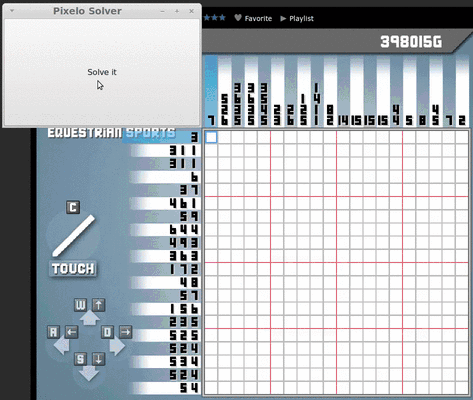

# PixeloSolver

Overview
--------

This application solves the Pixelo flash game available at
[kongregate](http://www.kongregate.com/games/tamaii/pixelo). Solving means:

  1. Taking a screenshot
  2. Analyzing the screenshot to find board and performing OCR to determine hint
     values. If a digit can't be recognized the application will output its
     black and white bitmap and ask for suggestion.
  3. Solving the game itself
  4. Clicking through the solution.

It is written in Haskell and uses some wxHaskell for GUI as well as x11 library
for simulating mouse clicks. Because of the x11 dependency it may not work on
Windows, but it is easy to write functions for it if availability on the Windows
system is necessary.

Install
-------

Run `runhaskell Setup.hs --help` for installation instruction. Alternatively I
recommend using a cabal sandbox via:

    cabal sandbox init
    cabal install --only-dependencies
    cabal configure
    cabal build

You can now find the executable in `dist/build/pixelosolver/`.

The application relies on gtk and x11. I recommend installing them from your
distribution's repository if there are any problems with the process.

Usage
-----

Run the pixelogame and pixelosolver. Load up a puzzle you want the program to
solve. Position the pixelosolver dialog so that the entire board is visible and
there are no ambiguous white patches around. Click the button and watch the
game become solved after a moment (less than a few second a modern PC).

Program checks for groups of white pixels and for example a high-score board is
sufficient to confuse the computer vision algorithm.

### Example

There is an example function which loads an image stored in a file and outputs
it to the console. This function is called `runStatic` in `Main` and could be
run with attached example screenshot in `resources/PixeloScreenshot.png`. To run
it just type:

    cabal repl
    runStatic "resources/PixeloScreenshot.png"

With this function you do not need to run the Pixelo game to see the program
working.

### Solve sets of puzzles

The Pixelo game groups all puzzles into categories: easy, normal, hard, daily.
In the Main package there is function called `runSets` which automatically moves
between puzzles in a set and solves them. This helps in the initial solving run
as it sufficient to start the function and leave the computer to solve the
puzzles or to grind XP or gold. The function does not perform any OCR and
instead relies on the user to provide pixel coordinates of buttons in the menu
(see documentation inside Main.hs). I recommend running this function in the
interpreter. On my system an example session looks as follows:

    let xPoss = [675, 780, 904, 1040, 1206] :: [Int]
    let yPoss = [530, 680, 810] :: [Int]
    let puzzleMenuPoss = yPoss >>= \y -> xPoss >>= \x -> return (y,x)

    import Control.Concurrent -- for threadDelay
    import Graphics.UI.Gtk -- for initGUI

    -- | Quickly alt+tab to the browser after running the below line
    threadDelay 1000000 
      >> initGUI 
      >> runSets 3 (930, 1090) puzzleMenuPoss
        (970, 1100) (310, 1240) (800, 800)
        1400000 5700000 4000000

Remarks and ideas for improvement
---------------------------------
* The screenshot analysis relies on some constants which I have chosen by hand
  and work my 1920x1080 resolution. On different setups it is likely the a
  different set of constants will be required. The meaning of constants is
  described in `PixeloSolver.AI.OCR and the constants themselves are in the
  Main.

* The entire solving algorithm runs in a wx thread which makes the window
  unresponsive for a moment. Normally I would offload the processing to a
  separate thread, but I couldn't find a way to provide wxHaskell's main thread
  to run the GUI parts of the processing (taking a screenshot and simulating
  mouse clicks). In wxPython this would be possible with wxEvents.

* On 1920x1080 resolution the program requires less than 1kB of stack, but
  memory profiling shows that the program uses around 140MB heap space (SYSTEM
  is the retainer). If I run the program without the GUI it uses around 6MB of
  heap space (exactly the size of the screenshot at 1920x1080 resolution).
  Unfortunately I can't decouple the OCR thread from wx Main thread, as
  described above, so the problem stays until it is solved.

* The application uses constants defining maximum size of a number and distance
  between digits to determine whether two digits on a hint strip form the same
  number. The function performing the merging of numbers is not bullet-proof and
  sometimes fails, for example when we have 4,10 or 2,10 numbers on the
  strip, since they are all very close. A way to solve this would be to either
  make the merging hints function take into account 3 next numbers instead of
  just 2. A more general idea would make the merging function generate all
  possible solutions and find one that minimizes some metric, for example
  the sum of squared differences between a distance between middle points of
  merged numbers and an the ideal distance between middles.
